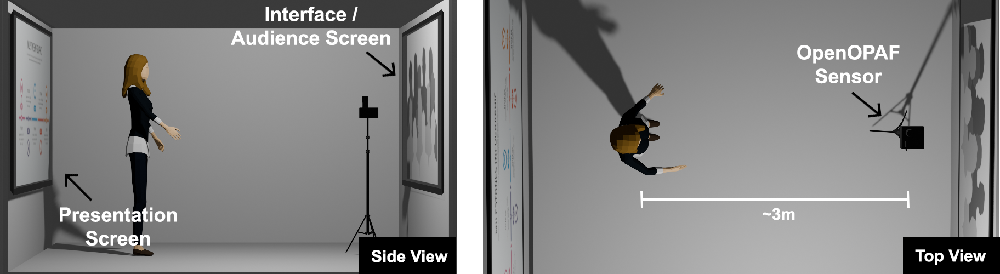

# Operation Manual
This is brief manual that explain the operation of the OpenOPAF system.

### Physical Installation
The system needs a frontal screen where the interface and audience will be projected.  The OpenOPAF sensor should be located in front of this screen pointing to the presenter.

Optionally, there should be a second screen where the slides of the presenter are projected.  There is no need to connect or sychronize this screen in any way.

   

---

### Creating a user

The system will greet you with the option to login or create a user.  You only need an email and a password.

The user authentication is used to separate the information about the different recordings.

---

### 2. **Audio Capture**

For audio capture, the system uses any **high-quality USB microphone**. The primary requirement is USB connectivity since the Jetson Nano lacks a standard audio jack. The microphone captures the speech features such as volume, articulation rate, and filled pauses. This is an example [microphone](https://www.amazon.com/gp/product/B06XCKGLTP).

#### Specifications:
- **Connectivity**: USB
- **Price Range**: 30 - 50 USD

---

### 3. **Video Capture**

For visual data capture, a **standard web camera** is used. It is capable of recording at 15 frames per second with a resolution of at least 800x600, making it suitable for capturing body posture, gaze direction, and other non-verbal presentation features. This is a sample [camera](https://www.amazon.com/gp/product/B06ZXW6QBV).

#### Specifications:
- **Resolution**: 800x600+
- **Frame Rate**: 15 fps
- **Price Range**: 30 - 70 USD

---

### 4. **Casing and Mounting**

The processing unit and sensors are housed in a custom **3D-printed case** that provides ventilation for the Jetson Nano, camera, and microphone mounting points, and options for tripod or wall mounting. The design ensures that the hardware setup is non-intrusive during presentations.

From this repository you can download 
- The [source code](Case.3mf) for the case to use in [Autodesk Fusion360](https://www.autodesk.com/products/fusion-360). 
- The compiled STL file ready to print for [the top](Top.stl)
- The compiled STL file ready to print for [the bottom](Bottom.stl)
---

### 5. **Additional Components**

The system can be expanded with additional hardware components such as:
- **Mini Wi-Fi Router**: For wireless connectivity. Here is an [example](https://www.amazon.com/gp/product/B073TSK26W/ref=ppx_yo_dt_b_search_asin_title?ie=UTF8&psc=1). Alternatively, you can get a WiFi dongle for the Jetson Nano. 
- **Tripod or Mount**: For camera positioning.

---

### 6. **Power Supply**

A **20-watt power source** is required to power the Jetson Nano’s GPU. Here is an [example](https://www.amazon.com/gp/product/B078RT3ZPS/ref=ppx_yo_dt_b_search_asin_title?ie=UTF8&psc=1). You need to set a jumper in the hardware to use the power source as described [here](https://forums.developer.nvidia.com/t/power-supply-considerations-for-jetson-nano-developer-kit/71637).

---

## Hardware Summary
The total hardware cost is estimated to be less than **500 USD**, making this system scalable and affordable for educational institutions and practitioners. The modular design allows for easy integration of additional sensors and functionalities.
