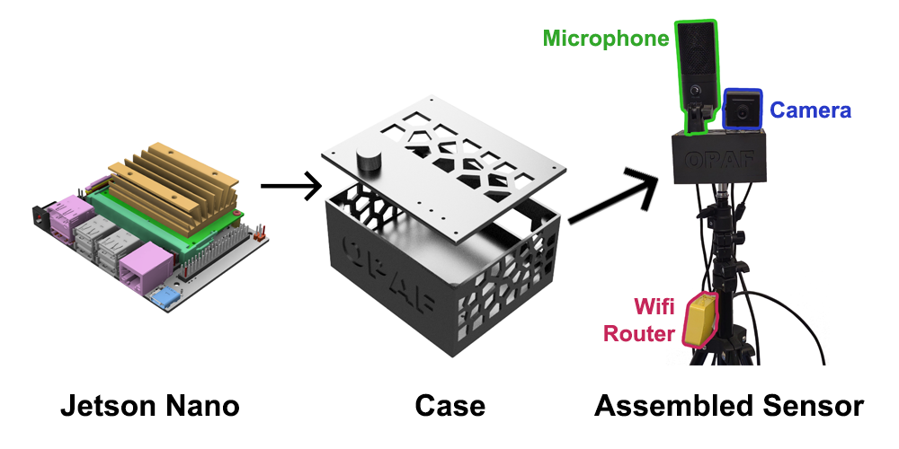

# Hardware Overview
OpenOPAF utilizes a combination of low-cost, off-the-shelf hardware components to enable real-time multimodal analysis of oral presentations. The core components and their functions are detailed below:

   

### 1. **Processing Unit**

The system uses the **NVIDIA Jetson Nano Developer Kit 4GB** as its processing unit. This low-cost microcomputer, featuring an integrated GPU, enables real-time deep neural network algorithms for feature extraction. It was chosen due to its capacity for handling complex multimodal processing tasks. An SD card of at least 64Gb is also needed.

It is available from several retailers, including [Amazon](https://www.amazon.com/onboard-Robotics-Machine-Learning-Version/dp/B0B8DMPWJL/ref=asc_df_B0B8DMPWJL/?tag=hyprod-20&linkCode=df0&hvadid=704452679955&hvpos=&hvnetw=g&hvrand=497056092875006271&hvpone=&hvptwo=&hvqmt=&hvdev=c&hvdvcmdl=&hvlocint=&hvlocphy=9198132&hvtargid=pla-1730740313246&psc=1&mcid=e5296abc18f6376a82da3aa7508d7b3e).  There is a new version, the [Nvidia Orin Nano](https://www.amazon.com/dp/B0BZJTQ5YP?nvid=em-945-13766-0005-000).  However, this version is more expensive and not tested with the software.   

#### Specifications:
- **GPU**: Tegra-class
- **Cost**: Between 100 - 200 USD
- **Operating System**: Ubuntu-based NVIDIA JetPack

---

### 2. **Audio Capture**

For audio capture, the system uses any **high-quality USB microphone**. The primary requirement is USB connectivity since the Jetson Nano lacks a standard audio jack. The microphone captures the speech features such as volume, articulation rate, and filled pauses. This is an example [microphone](https://www.amazon.com/gp/product/B06XCKGLTP).

#### Specifications:
- **Connectivity**: USB
- **Price Range**: 30 - 50 USD

---

### 3. **Video Capture**

For visual data capture, a **standard web camera** is used. It is capable of recording at 15 frames per second with a resolution of at least 800x600, making it suitable for capturing body posture, gaze direction, and other non-verbal presentation features. This is a sample [camera](https://www.amazon.com/gp/product/B06ZXW6QBV).

#### Specifications:
- **Resolution**: 800x600+
- **Frame Rate**: 15 fps
- **Price Range**: 30 - 70 USD

---

### 4. **Casing and Mounting**

The processing unit and sensors are housed in a custom **3D-printed case** that provides ventilation for the Jetson Nano, camera, and microphone mounting points, and options for tripod or wall mounting. The design ensures that the hardware setup is non-intrusive during presentations.

From this repository you can download 
- The [source code](Case.3mf) for the case to use in [Autodesk Fusion360](https://www.autodesk.com/products/fusion-360). 
- The compiled STL file ready to print for [the top](Top.stl)
- The compiled STL file ready to print for [the bottom](Bottom.stl)
---

### 5. **Additional Components**

The system can be expanded with additional hardware components such as:
- **Mini Wi-Fi Router**: For wireless connectivity. Here is an [example](https://www.amazon.com/gp/product/B073TSK26W/ref=ppx_yo_dt_b_search_asin_title?ie=UTF8&psc=1). Alternatively, you can get a WiFi dongle for the Jetson Nano. 
- **Tripod or Mount**: For camera positioning.

---

### 6. **Power Supply**

A **20-watt power source** is required to power the Jetson Nano’s GPU. Here is an [example](https://www.amazon.com/gp/product/B078RT3ZPS/ref=ppx_yo_dt_b_search_asin_title?ie=UTF8&psc=1).

---

## Hardware Summary
The total hardware cost is estimated to be less than **500 USD**, making this system scalable and affordable for educational institutions and practitioners. The modular design allows for easy integration of additional sensors and functionalities.

